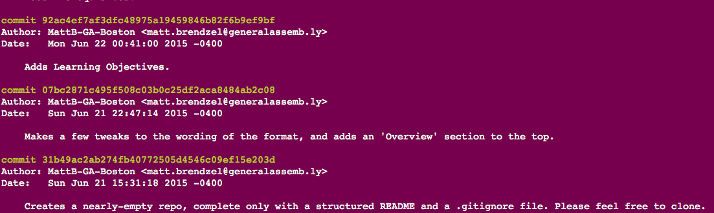
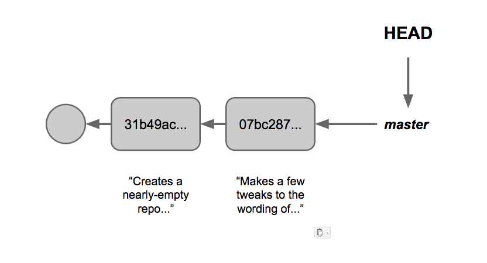
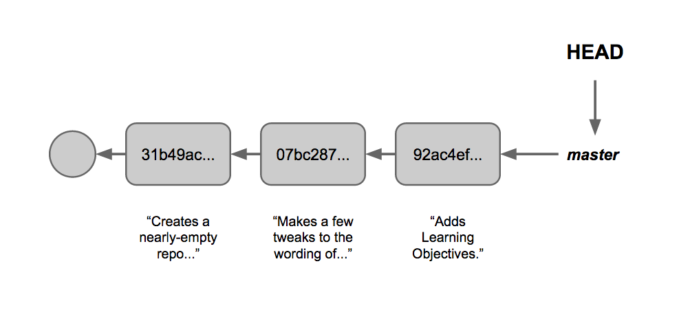
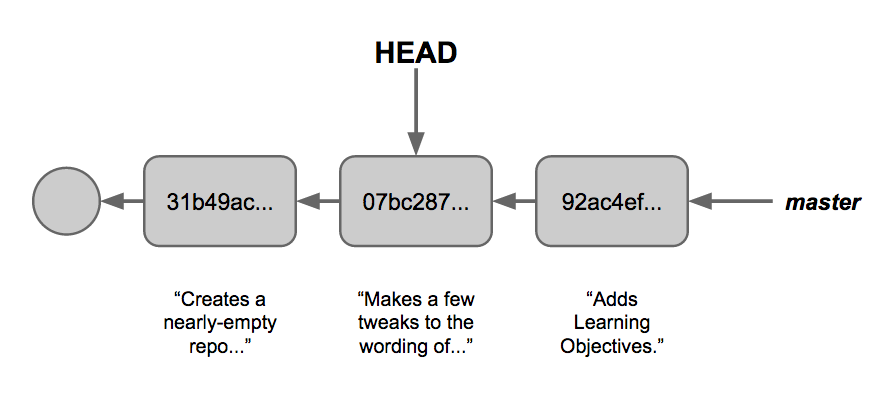
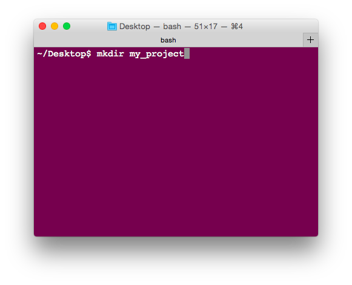
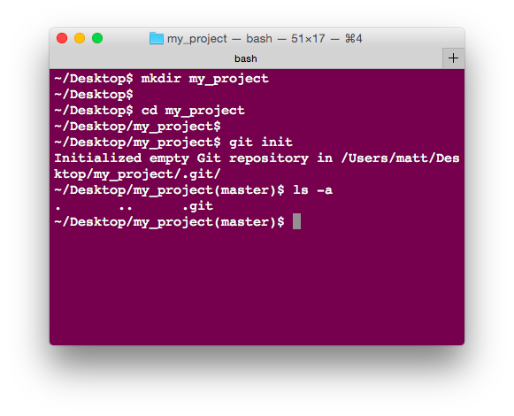
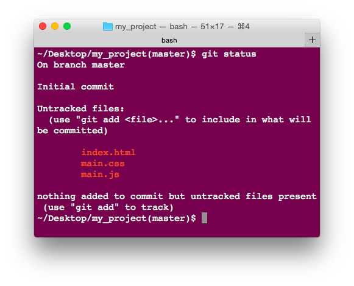
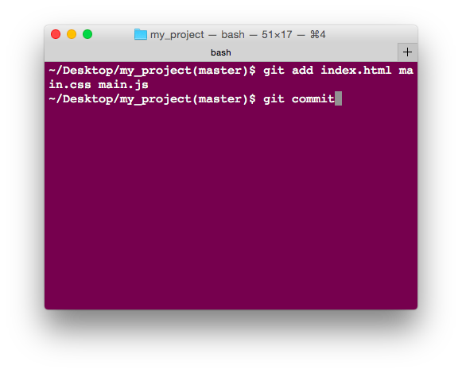
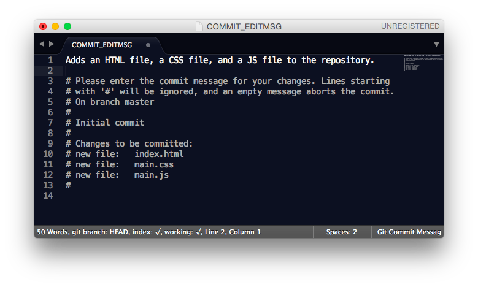
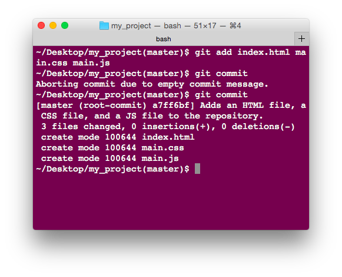

## Objectives

- Initialize a git repository.
- Stage changes to prepare them for a commit.
- Unstage changes that are not ready for a commit.
- Commit related changes with a descriptive message.
- Write commit messages using best practices.
- Travel through history to observe snapshots.
- View the status of the repository and the structure of the commits.
- Observe the differences between commits.
- Create topic branches based on your current task.
- List all available branches.
- Change branches.

- Fork and clone a repository.
- Update a repository from an upstream repository.
- Submit a pull request.


## Prerequisites
- Complete Chapter 2 of Fundamentals.

## Overview :: Version Control

Have you ever worked on a document - say, a resume - and produced a dozen different versions of it? What a pain. Not only do you need to keep track of what changes you make each time, you need a reasonable system for organizing and managing all of the different versions. Now imagine that you had 50 different versions, with multiple contributors, and that the document you were editing was 20 to 30 thousand lines long. Yeesh.

Software projects are made up of a **ton** of code, and often projects are so large, require so many iterations, and involve so many people that version control isn't a luxury - it's a **necessity**.

## Git
### Browsing Through History

Git is a version control tool designed by Linus Torvalds, the guy who invented Linux; it works by allowing users to create 'snapshots' that represent the state of the project (called a **repository**) at any moment in time.  

To look at that series of snapshots for any given Git repository, we simply need to navigate into the repository using the terminal and run the command `git log`. This will print out a sequential list of the snapshots (often causally referred to as _commits_) that have been made. Neat!



Each commit refers back to the state of the repository at a previous commit, like so:



`master` on the right is what's called a _branch_ - a reference that points to a particular commit. When new commits get made on the `master` branch, they get added to the end, and `master` is updated so that it points to the new commit.



> We'll be learning more about branches later in the course, so don't worry too much about them right now.

Of course, while it's interesting to be able to see a list of the snapshots, the system isn't very useful unless it actually allows us to revisit those old snapshots (and, if necessary, revert to them). Note the `HEAD` reference in the diagrams above: `HEAD` refers to the version of our project that we're currently 'reading' from the repository - in other words, the current state of our project if we were to look inside our directory. By moving the `HEAD` reference, we can effectively go back in time and see how our repository looked in a previous snapshot.

The command to do this is `git checkout x`, where x is the alphanumeric name for a particular commit. Say we wanted to check out the state of the repository at commit 07bc287.... ; typing

`git checkout 07bc2871c495f508c03b0c25df2aca8484ab2c08`

would move `HEAD` so that it pointed to the previous commit.



If we open our project in Sublime, we can see that the clock has been turned back. Awesome! Unfortunately, it's a "look, don't touch" sort of thing - while we're in what's called 'detached HEAD' mode, it's not possible to make new commits. However there are other commands that let us do that... but first, a lab!

#### Lab :: Browsing Through History

You were told to fork and clone this repository at the start of the lesson. For now, don't worry about what those two things mean.

In pairs, take ten minutes to look through the commit log in this repo, with a special eye to the `project` folder. Can you see the full history? Try to turn back the state of the repo to one, two, and three commits before the most recent commit. What changes have taken place inside the `project` repo with each commit?

### Making History

Let's take a closer look at how a repository gets built over time.

First, in order to even have a functioning repository, we need a whole bunch of Git machinery to make it all work. To set this up, we navigate into the folder where our project is going to go (let's call it `my_project`) and run `git init`.





This creates a hidden folder inside `my_project` called `.git`. We can actually see this folder if we type `ls -a` into the console - this command lets us see hidden files.

Next, we need to write some code! Without anything in our project, there won't be anything to save in the repository. Let's suppose that `my_project` is a website - we probably want an HTML file, a CSS file, and a JavaScript file.


Once we've created these files, Git immediately knows what's up; by running the command `git status`, we can see that it has detected three new files which are not currently part of any commits in the repository.
> To go even more granular, running `git diff` will show us the specific changes that have been made to each individual file.



In order to include these three files in our next snapshot, we need to run two commands: `git add`, which 'selects' files which files we include, and `git commit` which actually creates the snapshot.



Running `git commit` will open up a text editor where we can create a commit message - this is where we explain what our commit does and how it changes the repo.



If we're really in a rush, we can write `git commit -m "some message here"` and put our commit message inline; however, this has the disadvantage of not giving us much time or space to think about our commit messages.



And that's it! From then on, your workflow is simply
  1. Write some code
  2. `git add`
  3. `git commit`
  4. Repeat!

#### Lab :: Making History

In pairs, work together to make the following changes to this repository. Make a commit after each one, and make a resonable commit message each time to describe what that commit does.

1. Link your HTML to your CSS file by putting the following code in the `<head>` section.

  ```HTML
  <link rel="stylesheet" type="text/css" href="css/normalize.css">
  <link rel="stylesheet" type="text/css" href="css/main.css">
  ```

2. Make a folder inside `project` called `images`, and download an image of your choosing to place in there. Then, go into the HTML file and add an `` tag with a `src` attribute that links to your new image.

3. Insert the following CSS into your CSS file:

  ````css
  img {
    height: 100px
    border: 10px black solid;
  }
  ````

4. Write the following HTML somewhere in the index.html file:

  ```html
  <button id="make-alert"> CLICK ME </button>
  ```

5. Insert the following into your index.html file, in the bottom of the <body>:

  ```html
  <script src="https://code.jquery.com/jquery-2.1.4.js"></script>
  <script src="js/main.js"></script>
  ```

  Then, write the following into your `main.js` file:

  ```javascript
  $(document).ready(function(){
      $("#make-alert").on('click', function(){
        alert("BOOP BOOP ALERT ALERT");
      });
  });
  ```

6. Add the following to your `main.css` file:
  ```css
  body {
    background-color: red;
  }
  ```
7. Edit your `main.css` file and change the background-color of the body to 'blue'.

### Undoing History

In addition to allowing us to make snapshots, Git also gives us the ability to change or remove them. **Be careful!** It's very easy to shoot yourself in the foot while trying to rewrite history.

##### Re-do a Commit => Amend
To change a commit that you've just made - for instance, say that you made a typo in your commit message - you can write `git commit --amend`. This will pop up your editor window and allow you to write a new commit message. However, this new commit isn't being added to the previous one; it's replacing the previous commit entirely.

##### Undo a `git add`
To unstage a file that was 'staged' - marked for inclusion in the next commit - run the command `git reset filename`, where `filename` is the name of the file you want to exclude.

##### Revert to a prior commit
To go revert your repository to a prior commit, use the command `git reset --hard commit-name`, where `commit-name` is tha alphanumeric name of the commit that you want to wind back the clock to. **THIS ACTION IS DESCTRUCTIVE, AND WILL DESTROY ANY COMMITS THAT HAVE BEEN MADE SINCE THAT POINT.**
> Instead of writing the name of the commit, you can also write a reference that includes `HEAD`. For instance, writing `git reset --hard HEAD` will reset the repo to its state at the most recent commit, erasing all changes made since then; `git reset --hard HEAD~1` will reset the repo to one commit _before_ the last commit; etc.

#### Lab :: Undoing History

In pairs...

1. Undo the most recent commit. What color is the background of the page now?

2. Add a new file to the `css` directory called mobile.css and run `git add` on it to _tentatively_ include it in the next commit; however, instead of committing it, unstage the change.

3. Run `git log` to see your full commit history. Oh no! You forgot to mention that the sky was blue in your last commit. Rewrite your last commit message, adding the line "The sky is blue." to the end.

## Using Git with GitHub
### How GitHub Fits With Git

What is GitHub? GitHub is a for-profit company that provides online hosting of git repositories on GitHub.com. This makes it possible for large numbers of people to easily collaborate on Git projects from around the world.

Every GitHub user account has its own set of repositories, and every user has full control over their own repos, but no control (at least by default) of anyone else's. Since that's the case, how do people use GitHub to collaborate? Well, first, it is possible to explicitly create a list of collaborators for a particular project through GitHub's platform - that way, all collaborators can write to the common repository. This is less common, however. The more common approach is using 'forks' and 'pull requests', two features of the GitHub platform.

When you `fork` someone else's repo, GitHub creates a totally identical version of the repo and puts it under the control of your GitHub account. Since this repo is now under your control, you can write to it freely. Once you've made changes to it, you can then submit a `pull request`, which is essentially just a notification that asks the original owner to merge in changes that have been made on your `fork`.

### Working With Remotes

That's all well and good, but how do we actually tie Git (which is 'local' - on our personal computers) with a repo on GitHub (which is 'remote')?

As it turns out, this is pretty core functionality of Git. As part of every repository it creates, Git maintains a list of remote repositories which that repository is connected to. Typically, remotes are set up in one of two ways:
  - Manually: Your local repo exists independently of your remote repo. This remote repo must be added; the command to do that is `git remote add ' + some_name_for_the_remote  + ssh_url_for_the_remote, e.g.
      ```git
        git remote add origin git@github.com:ga-wdi-boston/wdi_1_github_intro.git
      ```
  - Automatically: If you create your repo on GitHub.com, you can use the command `git clone` to create your own local copy of the repo that's on GitHub. What's more, doing this will automatically set you up with at least one remote repo - the repo you cloned - which stored under the shortcut `origin`. If you're cloning a fork, you get _two_ remote repos pre-loaded: `origin`, which points to your fork, and `upstream`, which points the the original repo that your fork copied.

When you have local changes that you'd like to share up to your fork on GitHub, enter `git push origin` to push your changes up to the `origin`; then, once that's done, submit a pull request.

> If something changes on the original repo (the one you forked), and you want to make sure that your version includes that change, you can pull those changes into your local repo by running the command `git pull upstream`.

## Further Reading
- https://guides.github.com/activities/forking/
- https://www.atlassian.com/git/tutorials/setting-up-a-repository
- https://github.com/Gazler/githug
